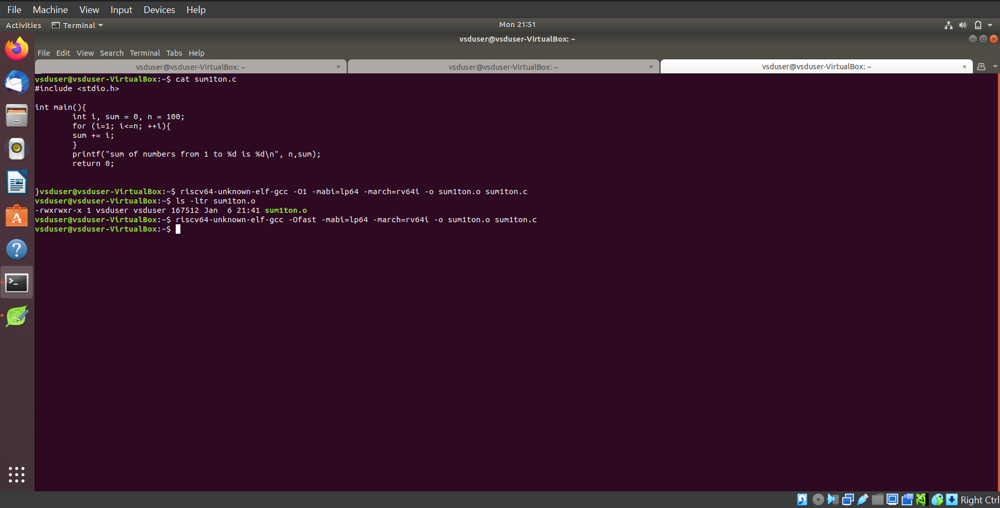
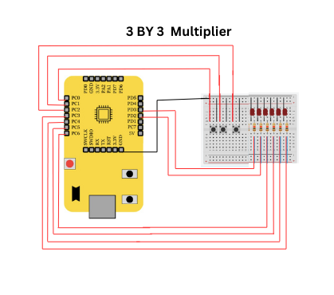

# RISC-V Internship Program powered by SAMSUNG and VSD

This RISC-V Internship using **VSDSquadron Mini** is based on the RISC-V architecture and leverages open-source tools to teach students about VLSI SoC Design and RISC-V. The program is guided by **Kunal Ghosh**, Founder of VSD.

## Basic Details

- **Name**: Gagan H  
- **College**: Sahyadri College of Engineering and Management, Mangaluru 575007  
- **Email**: [gagan.ec22@sahyadri.edu.in](gagan.ec22@sahyadri.edu.in)  
- **GitHub Profile**: [GaganH-Sahyadri-ECE](https://github.com/GaganH-Sahyadri-ECE)  
- **LinkedIn Profile**: [Gagan H](https://www.linkedin.com/in/gagan-h-ba69a9328?utm_source=share&utm_campaign=share_via&utm_content=profile&utm_medium=android_app)  
# Task-1

<details>
<summary>Task-1: C based lab screenshots</summary>

Here are the screenshots for the C-based lab:

  
  
  

</details>

<details>
<summary>Task-1: RISC-V based lab screenshots</summary>

Here are the screenshots for the RISC-V based lab:

  
  
  

</details>

# Task-2
<details>
<summary>SKIPE Simulation</summary>

Here are the screenshots for the SKIPE Simulation:

  
  

</details>

# Task 3
<details>
 <summary> RISC-V Instruction Decoding</summary>

Task 3 for the RISC-V Internship program, focusing on decoding RISC-V instructions. The task includes analyzing `riscv-objdump` output, identifying 15 unique instructions, and documenting their 32-bit binary instruction formats based on their respective types (R, I, S, B, U, and J).

---

## Task Objectives

1. **Understand RISC-V Instruction Types**  
   Review the RISC-V software documentation to study the following instruction formats:
   - **R-Type:** Register-register operations (e.g., ADD, SUB).
   - **I-Type:** Immediate operations (e.g., LW, JALR).
   - **S-Type:** Store instructions (e.g., SW).
   - **B-Type:** Branch instructions (e.g., BEQ, BNE).
   - **U-Type:** Upper immediate operations (e.g., LUI, AUIPC).
   - **J-Type:** Jump instructions (e.g., JAL).

2. **Identify Unique Instructions**  
   From the `riscv-objdump` output of application code, identify **15 unique instructions**.

3. **Decode Instructions**  
   For each of the identified instructions, determine the **32-bit binary instruction code** in their specific format.

---

## RISC-V Instruction Types

### 1. R-Type Format
R-type instructions perform operations between registers.
Example: `ADD` (x1 = x2 + x3)

### 2. I-Type Format
I-type instructions involve immediate values.
Example: `LW` (x4 = MEM[x5 + imm])

### 3. S-Type Format
S-type instructions are used for memory store operations.
Example: `SW` (MEM[x5 + imm] = x4)

### 4. B-Type Format
B-type instructions perform conditional branches.
Example: `BEQ` (if x6 == x7, branch to offset)

### 5. U-Type Format
U-type instructions load or modify upper immediate values.
Example: `LUI` (x1 = imm << 12)

### 6. J-Type Format
J-type instructions are used for jumps.
Example: `JAL` (x1 = PC + 4, PC = PC + offset)

---

## Instruction Decoding Table

The following table provides the 15 unique instructions, their types, and their 32-bit binary representations:

| **Instruction** | **Type**   | **Binary Pattern**               | **Explanation**                                   |
|------------------|------------|-----------------------------------|---------------------------------------------------|
| ADD              | R-Type     | `0000000 00010 00011 000 00100 0110011` | Adds values in registers x2 and x3, stores in x4. |
| SUB              | R-Type     | `0100000 00010 00011 000 00100 0110011` | Subtracts x3 from x2, stores in x4.              |
| LW               | I-Type     | `0000000 00010 00100 010 00001 0000011` | Loads a word from memory address into x1.         |
| SW               | S-Type     | `0000000 00101 00100 010 00001 0100011` | Stores word from x1 to memory at x5 + offset.    |
| BEQ              | B-Type     | `0000000 00110 00111 000 01000 1100011` | Branches if x6 equals x7.                        |
| BNE              | B-Type     | `0000000 00110 00111 001 01000 1100011` | Branches if x6 does not equal x7.               |
| JAL              | J-Type     | `0000000 00000 00101 000 00010 1101111` | Jumps to label, stores return address in x5.     |
| JALR             | I-Type     | `0000000 00001 00100 000 00000 1100111` | Jumps to address in x4 + imm, stores PC+4 in x1. |
| LUI              | U-Type     | `0000000 00000 00100 000 00000 0110111` | Loads upper immediate value to x4.              |
| AUIPC            | U-Type     | `0000000 00000 00100 000 00000 0010111` | Adds upper immediate value to PC, stores in x4. |
| NOP              | I-Type     | `0000000 00000 00000 000 00000 0000001` | No operation.                                    |
| AND              | R-Type     | `0000000 00010 00011 111 00100 0110011` | Logical AND of x2 and x3, result in x4.          |
| OR               | R-Type     | `0000000 00010 00011 110 00100 0110011` | Logical OR of x2 and x3, result in x4.           |
| XOR              | R-Type     | `0000000 00010 00011 100 00100 0110011` | Logical XOR of x2 and x3, result in x4.          |
| SLT              | R-Type     | `0000000 00010 00011 010 00100 0110011` | Sets x4 to 1 if x2 < x3.                         |

---

## Conclusion

In Task 3 of the RISC-V Internship program, the focus was on understanding and decoding various RISC-V instruction formats (R, I, S, B, U, and J). By analyzing the `riscv-objdump` output, we identified 15 unique instructions and provided their corresponding 32-bit binary representations. This task enhanced our understanding of RISC-V instruction formats and how they are encoded in machine language, helping in building a strong foundation for low-level programming and system design.

---
Here are the screenshots for the RISC-V Instruction Decoding:


 
 
 
 ---

## How to Run

### Steps to Analyze and Decode Instructions

1. **Setup RISC-V Toolchain**
   - Install RISC-V GCC and associated tools:
     ```bash
     sudo apt update
     sudo apt install gcc-riscv64-linux-gnu gdb-multiarch
     ```

2. **Generate `riscv-objdump` Output**
   - Compile application code to create an ELF file:
     ```bash
     riscv64-unknown-elf-gcc -o application.elf application.c
     ```
   - Generate the assembly dump:
     ```bash
     riscv64-unknown-elf-objdump -d application.elf > objdump_output.txt
     ```

3. **Decode Instructions**
   - Use the RISC-V manual to decode instructions from the dump.

---
</details>


# Task 4
<details>
 <summary> Functional Simulation of RISC-V Core</summary>
 
This project involves performing a functional simulation of a RISC-V core using a provided Verilog netlist and testbench. The task was completed as part of the RISC-V Internship Program.

### Objective
Simulate the RISC-V core using the provided Verilog netlist and testbench to verify its functionality. The simulation results are captured and visualized using waveform snapshots.
 
### Steps
# RISC-V Core Functional Simulation

This repository contains the necessary files and instructions to simulate a RISC-V core using Verilog. The simulation setup includes the RISC-V hardware description (netlist) and a testbench file for input stimuli.

## Steps to Run the Simulation

### 1. Download Files
- **Verilog Netlist**: The hardware description file for the RISC-V core (`netlist.v`).
- **Testbench**: The file (`testbench.v`) provides input stimuli and expected outputs for the simulation.

### 2. Set Up Simulation Environment

#### Install Required Tools
 Make sure the following tools are installed:
- **iverilog** for compiling Verilog code:
  ```bash
  sudo apt-get install iverilog
  ```
- **gtkwave** for waveform visualization:
  ```bash
  sudo apt-get install gtkwave
  ```
- **Prepare** Simulation Files
 Create a directory for organizing your simulation files:

  ```bash
  mkdir -/riscv_simulation
  ```
 Place netlist.v and testbench.v into this directory.
 

### 3. Load Verilog Files into the Simulator
Compile the Verilog netlist and testbench using iverilog:

  ```bash
  iverilog -o risc_v_simulation.vvp netlist.v testbench.v
  ```
This will generate the risc_v_simulation.vvp output file, which contains the compiled simulation.

### 4. Run Functional Simulation
Execute the simulation with the following command:

 ```bash
 vvp risc_v_simulation.vvp
 ```
### 5. Observe the Output
After running the simulation, you can observe the output signals generated by the RISC-V core. If you want to visualize the waveforms, use gtkwave:

 ```bash
 gtkwave output.vcd
 ```
This will open the waveform viewer for detailed signal analysis.

Here are the screenshots for the Functional Simulation of RISC-V Core:


 
 
 
 
 

---
</details>

# Task 5

<details>
 <summary>To implement any digital circuit using VSDSquadron Mini and check whether building and uploading of C program file on RISC-V processor works.</summary>

# 3×3 Multiplier using VSD Squadron Mini

## Overview
This project demonstrates the implementation of a **3×3 multiplier** circuit using the **VSD Squadron Mini**. A binary multiplier is a fundamental digital circuit that performs multiplication of two binary numbers. The goal of this project is to perform 3-bit multiplication and display the 6-bit result using LEDs.

### Key Features:
- Takes two 3-bit binary inputs using push buttons.
- Implements 3×3 binary multiplication logic in software.
- Displays the 6-bit multiplication result on LEDs.
- Uses the **RISC-V** processor to control the logic operations.
- Provides hands-on experience with arithmetic operations in digital logic.

## Components Required
- **VSD Squadron Mini**
- **Push buttons** (6 input buttons for two 3-bit numbers)
- **6 LEDs** (to display the output)
- **Breadboard**
- **Jumper wires**
- **VS Code** (for software development)
- **PlatformIO** (multi-framework professional IDE)

## Hardware Connections
- **Inputs**: Six push-button inputs are connected to the GPIO Pins of **VSD Squadron Mini** (3 for operand A, 3 for operand B).
- **Output**: Six LEDs are connected to GPIO pins to display the multiplication result.
- **Wiring**: GPIO pins are configured according to the reference manual for correct operation.

## Working and Block Diagram
 

### Physical Circuit:
- Two sets of 3-bit binary numbers are given as inputs via push buttons.
- The selection logic reads the values of both numbers and computes the multiplication.
- The 6-bit result is displayed on LEDs.

### Multiplication Logic:
1. **Binary Multiplication Process:**
   - The two 3-bit numbers (A and B) are multiplied to produce a 6-bit result.
   - Example: If **A = 101 (5 in decimal)** and **B = 011 (3 in decimal)**, then **A × B = 1111 (15 in decimal)**.
   
2. **Bitwise Multiplication & Addition:**
   - Each bit of B is multiplied with all bits of A.
   - The results are shifted and added to generate the final 6-bit output.

3. **Output Representation:**
   - The final 6-bit product is displayed on LEDs.
   - LSB (Least Significant Bit) represents the smallest value, and MSB (Most Significant Bit) represents the highest.


</details>

# Task 6

<details>
 <summary> Building and uploading of C program file on RISCV processor and implementation.</summary>
 ### Working

## **1. Input Handling:**
- Two **3-bit binary numbers (A and B)** are entered using push buttons.
- A **reset button** is provided to clear inputs.

## **2. Multiplication Logic:**
- The **two 3-bit numbers (0 to 7)** are multiplied.
- The result is stored as an **8-bit binary value (0 to 49)**.

### **3. Output Representation:**
- The **8-bit result** is displayed using LEDs.
- **LSBs (Lower 4 bits)** → **Port C LEDs**.
- **MSBs (Upper 4 bits)** → **Port D LEDs**.

## **4. Button Debouncing:**
- A **delay mechanism** prevents false triggering.

## **5. Real-time Operation:**
- When a button is pressed, the input value is updated.
- The multiplication result is dynamically updated and displayed.

## **6. Reset Functionality:**
- Pressing the **reset button** clears the inputs and resets the output.


## Truth Table for 3×3 Multiplier

| A2 | A1 | A0 | B2 | B1 | B0 | Output (P5 P4 P3 P2 P1 P0) |
|----|----|----|----|----|----|----------------------------|
|  0 |  0 |  0 |  0 |  0 |  0 | 000000 |
|  0 |  0 |  1 |  0 |  0 |  1 | 000001 |
|  0 |  1 |  0 |  0 |  1 |  0 | 000010 |
|  0 |  1 |  1 |  0 |  1 |  1 | 000111 |
|  1 |  0 |  0 |  1 |  0 |  0 | 010000 |
|  1 |  0 |  1 |  1 |  0 |  1 | 010101 |
|  1 |  1 |  0 |  1 |  1 |  0 | 011100 |
|  1 |  1 |  1 |  1 |  1 |  1 | 111001 |


## Program
```
#include <stdio.h>
#include <debug.h>
#include <ch32v00x.h>

void GPIO_Config(void)
{
    GPIO_InitTypeDef GPIO_InitStructure = {0}; // Structure variable for GPIO config
    RCC_APB2PeriphClockCmd(RCC_APB2Periph_GPIOD, ENABLE); // Enable Port D clock
    RCC_APB2PeriphClockCmd(RCC_APB2Periph_GPIOC, ENABLE); // Enable Port C clock
	
    // 3-bit inputs (A, B) and Reset Button
    GPIO_InitStructure.GPIO_Pin = GPIO_Pin_0 | GPIO_Pin_1 | GPIO_Pin_2;
    GPIO_InitStructure.GPIO_Mode = GPIO_Mode_IPU; 
    GPIO_Init(GPIOC, &GPIO_InitStructure);
    
    // 4 output bits from Port C (bit 0-3)
    GPIO_InitStructure.GPIO_Pin = GPIO_Pin_3 | GPIO_Pin_4 | GPIO_Pin_5 | GPIO_Pin_6;
    GPIO_InitStructure.GPIO_Mode = GPIO_Mode_Out_PP; 
    GPIO_InitStructure.GPIO_Speed = GPIO_Speed_50MHz;
    GPIO_Init(GPIOC, &GPIO_InitStructure);
    
    // 2 output bits from Port D (bit 4-5)
    GPIO_InitStructure.GPIO_Pin = GPIO_Pin_2 | GPIO_Pin_3;
    GPIO_InitStructure.GPIO_Mode = GPIO_Mode_Out_PP; 
    GPIO_InitStructure.GPIO_Speed = GPIO_Speed_50MHz;
    GPIO_Init(GPIOD, &GPIO_InitStructure);
}

int main()
{
    uint8_t a = 0;
    uint8_t b = 0;
    
    NVIC_PriorityGroupConfig(NVIC_PriorityGroup_1);
    SystemCoreClockUpdate();
    Delay_Init();
    GPIO_Config();

    while (1)
    {
        uint8_t curStateA = SET, prevStateA = SET;
        uint8_t curStateB = SET, prevStateB = SET;
        
        curStateA = GPIO_ReadInputDataBit(GPIOC, GPIO_Pin_0);
        curStateB = GPIO_ReadInputDataBit(GPIOC, GPIO_Pin_1);

        // Reset logic
        if (GPIO_ReadInputDataBit(GPIOC, GPIO_Pin_2) == RESET)
        {
            Delay_Ms(30);
            while (GPIO_ReadInputDataBit(GPIOC, GPIO_Pin_2) == RESET);
            a = 0;
            b = 0;
        }
        
        // Increment a on button press
        if (curStateA != prevStateA && curStateA == RESET)
        {
            Delay_Ms(30);
            curStateA = GPIO_ReadInputDataBit(GPIOC, GPIO_Pin_0);
            if (curStateA == RESET)
            {
                a = (a + 1) % 8; // Ensure it stays within 3 bits (0-7)
                while (GPIO_ReadInputDataBit(GPIOC, GPIO_Pin_0) == RESET);
            }
        }
        
        // Increment b on button press
        if (curStateB != prevStateB && curStateB == RESET)
        {
            Delay_Ms(30);
            curStateB = GPIO_ReadInputDataBit(GPIOC, GPIO_Pin_1);
            if (curStateB == RESET)
            {
                b = (b + 1) % 8; // Ensure it stays within 3 bits (0-7)
                while (GPIO_ReadInputDataBit(GPIOC, GPIO_Pin_1) == RESET);
            }
        }

        // Compute 3x3 multiplication result (max value = 49, fits in 6 bits)
        uint8_t mul = a * b;

        // Output result to LEDs
        GPIO_WriteBit(GPIOC, GPIO_Pin_3, (mul & 1) ? SET : RESET);
        GPIO_WriteBit(GPIOC, GPIO_Pin_4, (mul & 2) ? SET : RESET);
        GPIO_WriteBit(GPIOC, GPIO_Pin_5, (mul & 4) ? SET : RESET);
        GPIO_WriteBit(GPIOC, GPIO_Pin_6, (mul & 8) ? SET : RESET);
        GPIO_WriteBit(GPIOD, GPIO_Pin_2, (mul & 16) ? SET : RESET);
        GPIO_WriteBit(GPIOD, GPIO_Pin_3, (mul & 32) ? SET : RESET);

        Delay_Ms(100);
    }
}
```
</details>


